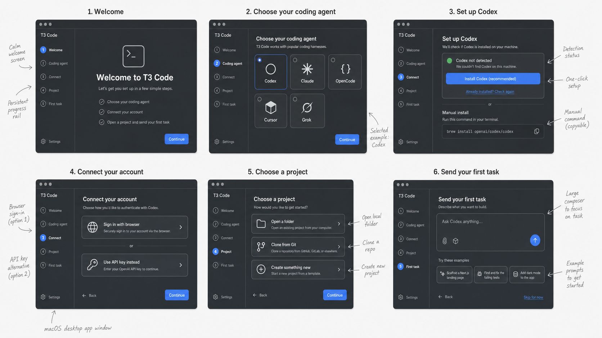
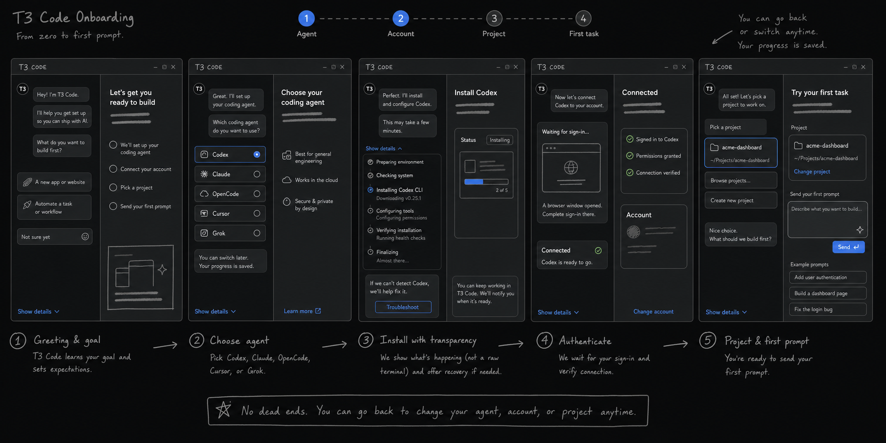
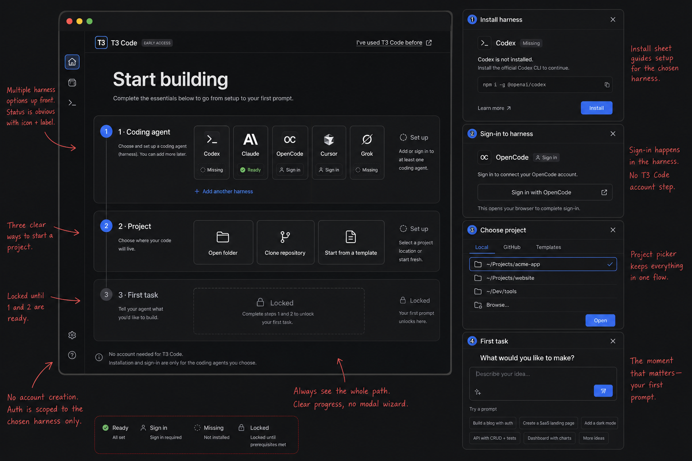
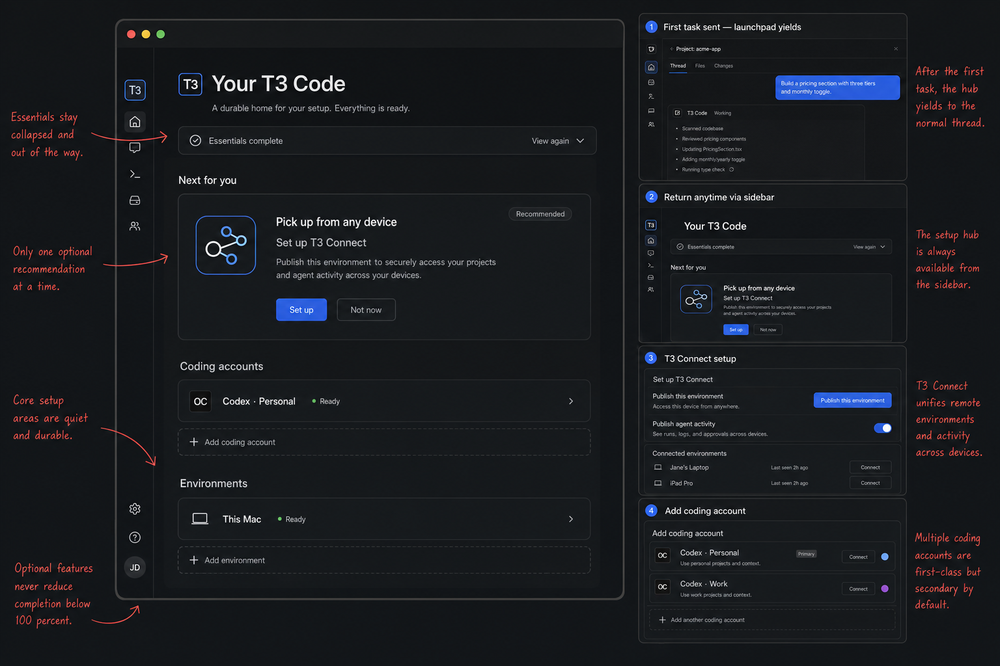

# First-run onboarding exploration

Status: lo-fi product exploration, not an implementation specification.

## Product outcome

A first-time user can go from opening T3 Code with no provider CLI installed to sending a useful first prompt in a real project.

The activation event is **the first prompt sent**. Provider installation, provider authentication, and project selection are prerequisites rather than goals in their own right.

## Recommended direction

Use a hybrid of the **readiness launchpad** and the **guided wizard**:

- Begin on a small launchpad that shows the whole path: coding agent, project, first task.
- Open one focused setup surface for the current incomplete item.
- Use the guided wizard's strong sequencing inside that surface.
- Borrow the setup companion's plain-language explanations, progress detail, and recovery paths without turning onboarding into a chat transcript.
- Collapse or dismiss the launchpad once the first task is sent. Later provider management belongs in Settings.

This gives new users a clear next action while keeping progress and remaining work visible. It also lets experienced users take fast paths without clicking through introductory screens.

## Journey

1. **Detect**
   - Check supported provider CLIs, authentication readiness, and likely project folders in the background.
   - Never assume a provider is installed just because it is enabled by default.
2. **Choose a coding agent**
   - Use the product term "coding agent" in primary UI; reserve "provider" or "harness" for technical detail.
   - Show Codex, Claude, OpenCode, Cursor, and Grok with explicit states: Ready, Sign in, Missing, or Unsupported.
   - Prefer an already-ready choice, but let the user choose freely and explain that more can be added later.
3. **Make the agent ready**
   - Ready: continue immediately.
   - Missing: offer a reviewed one-click install action and a copyable manual command.
   - Sign in: open the provider's browser flow when supported and offer provider-specific alternatives such as an API key.
   - Verify installation and authentication before continuing.
4. **Choose a project**
   - Open a local folder.
   - Clone a Git repository.
   - Create something new. Templates can be a later layer if scaffolding is not ready for the first release.
5. **Send the first task**
   - Put the normal T3 Code composer at the center of the screen.
   - Offer a few project-aware examples, not generic prompt-writing education.
   - Sending the prompt completes onboarding and transitions into the normal thread UI.

## Product principles

- **Detect, then ask.** Preflight the machine and skip work that is already complete.
- **Outcome language first.** Say "coding agent" and "connect your account"; put commands, PATH details, and logs behind "Show details."
- **No dead ends.** Every failure state needs Check again, Try another method, Change coding agent, and a useful diagnostic.
- **Transparent automation.** Before T3 Code runs an install command, show what will happen and where it will run. Keep the detailed output available.
- **Provider-scoped authentication.** Do not imply that a T3 Code account is required to authenticate a local coding agent.
- **Resume safely.** Persist completed steps and recover correctly after browser auth, app restart, CLI install, or PATH changes.
- **Keep the product visible.** The final onboarding state should already resemble the real composer and project context, not a disposable success screen.
- **Accessibility is semantic.** Pair status color with an icon and label; keep keyboard navigation and screen-reader announcements in the design from the start.

## Important branches

| Condition                                                      | Experience                                                                                  |
| -------------------------------------------------------------- | ------------------------------------------------------------------------------------------- |
| One agent is already ready                                     | Preselect it and offer a direct path to Project.                                            |
| Several agents are ready                                       | Ask which to start with; explain that the choice is not permanent.                          |
| Agent is installed but not authenticated                       | Skip installation and open its sign-in step.                                                |
| Install succeeds but binary is not on the app PATH             | Explain the PATH issue, show detected locations, and offer restart/recheck guidance.        |
| Package manager is missing or one-click install is unsupported | Lead with the provider's official manual instructions and keep Check again available.       |
| Browser authentication is cancelled or times out               | Preserve progress and offer Retry, API key/alternative auth, or Change agent.               |
| No existing project is available                               | Offer an empty folder or a narrowly scoped starter project rather than blocking activation. |
| User leaves during setup                                       | Resume on the first incomplete prerequisite after detection runs again.                     |

## Concepts

### A — Guided wizard

Best at teaching and sequencing. The persistent rail is reassuring, but a full-screen wizard can feel slow for returning or partially configured users.

### B — Setup companion

Best at explanation, transparent progress, and recovery. The split conversation adds density and risks teaching a temporary interaction model that disappears after onboarding.

### C — Readiness launchpad

Best product foundation. It keeps the path visible, represents partial readiness naturally, and can become a useful empty state. Individual setup sheets still need the focus and sequencing shown in concept A.

## After the first task

The launchpad can evolve into a durable setup hub without making advanced capabilities part of mandatory onboarding. The companion can remain as its contextual delivery mechanism.

The proposed lifecycle, T3 Connect path, remote-environment discovery, and multi-account behavior are detailed in [post-activation.md](./post-activation.md).

The follow-on recommendation system is explored in [coach.md](./coach.md): a smart bottom-left popup that can surface at most one useful suggestion per app start.

## Open decisions before implementation

1. Which platforms and package managers can safely support a one-click install in the first release?
2. Which provider authentication flows can T3 Code launch and verify directly?
3. Does "Create something new" initially create an empty folder, run a curated scaffold, or both?
4. Are all five current providers first-class onboarding choices, or should early-access providers live behind "More options"?
5. What exact state is persisted, and what machine facts are always re-detected on resume?
6. What event schema measures drop-off without capturing commands, paths, repository names, or prompt content?

## Suggested validation

Prototype the hybrid flow and test it against four fixtures:

- clean machine with no provider CLI;
- provider installed but signed out;
- provider ready with no project selected;
- returning user with provider and project ready.

The main usability measure is whether a user who does not know the words CLI, PATH, or harness can send a first task without outside documentation.

The exact image-generation briefs are recorded in [prompts.md](./prompts.md).
