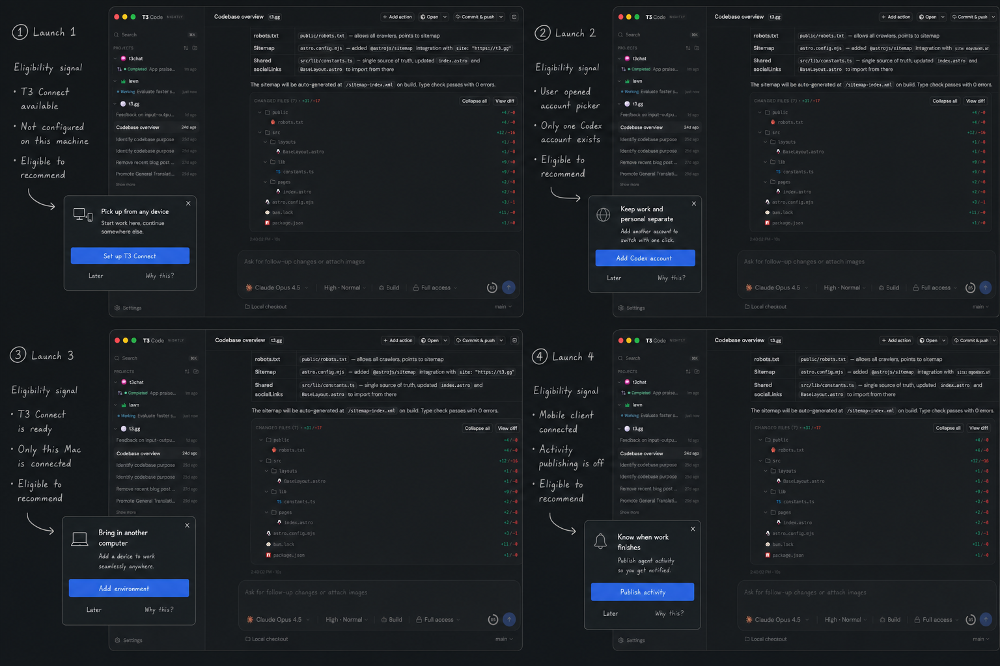
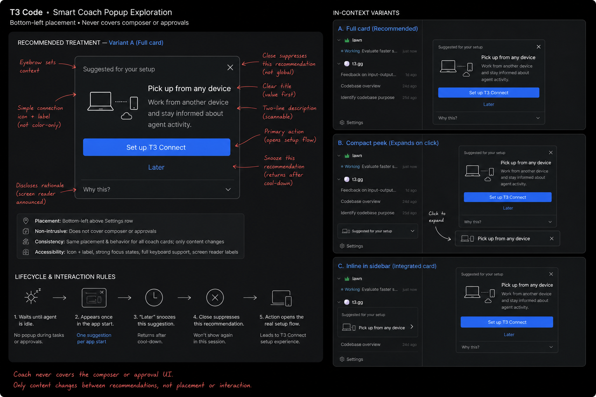
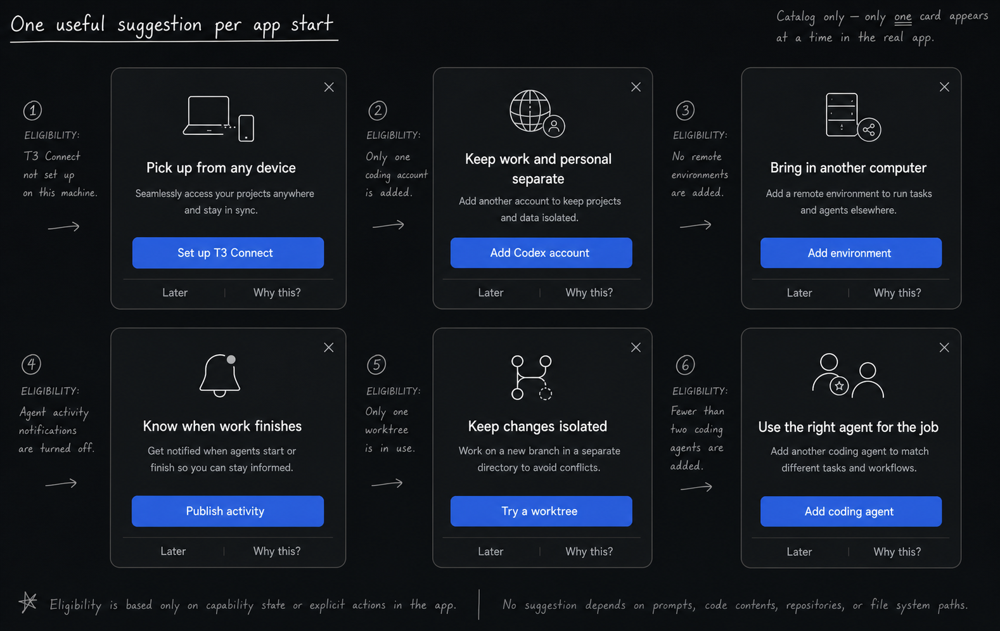

# Smart product coach

Status: lo-fi product exploration.

## Concept

After first-run onboarding, T3 Code may show one useful, optional suggestion near the bottom-left of the app. The coach is a delivery mechanism for existing product surfaces, not a second setup system.

**One suggestion per app start is a ceiling, not a target.** Many app starts should show no coach at all.

## Recommended treatment

Use a quiet floating card immediately above the Settings row.

The full card is preferable to the alternatives:

- It clearly reads as temporary, unlike an integrated sidebar card.
- It has enough space to explain the outcome and why it was selected.
- It is harder to mistake for navigation than a compact expandable pill.
- It can remain keyboard accessible without relying on hover behavior.

The component anatomy stays fixed:

1. Small context label: **Suggested for your setup**.
2. Outcome-first title and two-line description.
3. One primary action that opens the real product flow.
4. **Later** to snooze the recommendation across app starts.
5. Close to suppress this specific recommendation.
6. **Why this?** to disclose the eligibility fact in plain language.

## Display contract

- Only after the user has completed first-run onboarding.
- At most once during an app start, after the first quiet moment.
- Never while an agent is streaming, waiting for approval or user input, or presenting an error that needs attention.
- Never on top of the composer, approval UI, dialogs, menus, or update notifications.
- If the user chooses Later or close, do not replace the card with another recommendation during the same app start.
- Opening the primary action removes the coach while the destination flow is active.
- Completing the action marks the recommendation complete; the underlying capability remains manageable in its normal surface.

## Smart eligibility

Eligibility should use explicit, non-sensitive product state:

- installed and authenticated coding agents;
- number and health of configured agent instances;
- T3 Connect availability and link state;
- number of known environments;
- agent-activity publishing state;
- whether a supported project can use worktrees;
- explicit UI intent, such as opening the coding-account picker or Connections.

Do not rank recommendations from prompts, code contents, repository names, filesystem paths, account identity, or inferred work/personal context.

**Why this?** should expose the exact safe reason, for example: "T3 Connect is available but isn't set up on this Mac."

## Recommendation ranking

A deterministic order is easier to trust than an engagement feed:

1. Resume a setup the user explicitly started.
2. Recover a capability the user already enabled and that now needs attention.
3. Follow explicit recent intent, such as opening the account picker or Connections.
4. Offer the highest-value eligible capability, initially T3 Connect.
5. Otherwise show nothing.

Snoozed and suppressed recommendations are removed before ranking. The system should record the selected recommendation at app start so live state changes do not swap the card underneath the user.

## Candidate recommendations

| Recommendation                  | Example eligibility                                                                | Destination                       |
| ------------------------------- | ---------------------------------------------------------------------------------- | --------------------------------- |
| Pick up from any device         | T3 Connect is available, not configured, and not dismissed.                        | T3 Connect value and sign-in flow |
| Keep work and personal separate | One Codex account exists and the user explicitly opened the account picker.        | Add another Codex account         |
| Bring in another computer       | T3 Connect is ready but only this environment is known.                            | Add environment                   |
| Know when work finishes         | A mobile client exists and activity publishing is off.                             | Publish agent activity            |
| Keep changes isolated           | The selected Git project supports worktrees and the user has not tried one.        | New worktree flow                 |
| Use the right agent for the job | Only one coding agent is configured and the user opened agent/provider management. | Add coding agent                  |

These are catalog entries. The real app displays only the single highest-ranked eligible card.

## State implication

Each recommendation needs durable state separate from capability state:

- `eligible`
- `selectedForAppStart`
- `shownAt`
- `snoozedUntil`
- `suppressedAt`
- `startedAt`
- `completedAt`

Capability state answers whether an action is useful. Recommendation state answers whether T3 Code should talk about it now.
