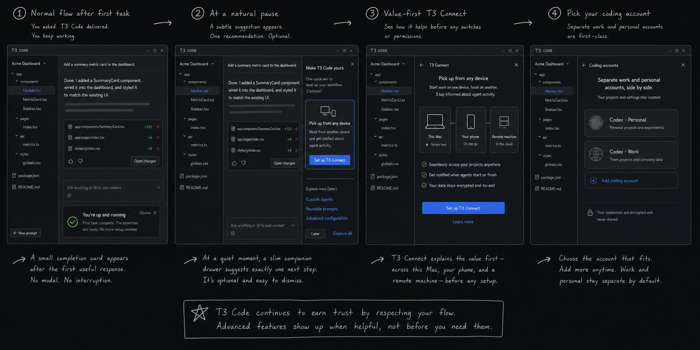

# Post-activation journey

Status: product exploration following the first-run concepts.

## Recommendation

Make the launchpad the durable product structure and the companion a lightweight delivery pattern inside it.

Before activation, the launchpad answers: **What must I do to send my first task?**

After activation, it becomes **Your T3 Code** and answers:

- What is ready?
- What is the one most useful thing I could set up next?
- Where do I manage coding agents, accounts, and environments later?

Optional features must never make a fully onboarded user look partially configured.

## The prominence curve

### 1. First task sent

- Immediately yield from the launchpad to the normal project thread.
- Do not show Connect, remote access, another account, or another product pitch.
- The user's attention belongs to the agent and its first response.

### 2. First useful response completed

- Onboarding is complete.
- A small dismissible inline card may say "You're up and running" and link back to the setup hub.
- Do not put an advanced-feature CTA in this card.
- The card should disappear after acknowledgement and never become a permanent timeline artifact.

### 3. Natural pause or later return

- Surface one recommendation under **Next for you**.
- For most eligible desktop users, recommend T3 Connect with the outcome "Pick up from any device."
- Offer **Set up** and **Not now**. Dismissal is durable; the feature remains available in the setup hub.
- Never stack Connect, remote SSH, multi-account, mobile, and notification prompts together.

### 4. Contextual discovery

- Opening the model/account picker reveals **Add another Codex account** beneath existing Codex choices.
- Opening Connections or choosing **Add environment** reveals T3 Connect, remote pairing, and SSH paths.
- Opening the setup hub exposes the complete inventory without turning every item into a recommendation.

## Evolved companion

The companion should fade from a full onboarding conversation into a contextual guide:

- an inline completion acknowledgement after the first useful response;
- a slim optional drawer at a quiet moment;
- a value-first explainer before a complex setup flow;
- contextual education in the account picker or Connections surface.

It should never present itself as another agent, generate an ongoing transcript, interrupt an active run, or compete with approval and error UI.

## Evolved launchpad

The full-screen first-run launchpad becomes a user-invoked setup hub:

1. **Essentials complete** — collapsed by default, with the original setup available for review.
2. **Next for you** — exactly one optional, dismissible recommendation.
3. **Coding agents** — durable inventory of configured agents and labeled accounts.
4. **Environments** — this machine plus local, remote, SSH, and T3 Connect environments.

The hub should be reachable from a stable sidebar item, Settings, and the command palette. It should not reopen automatically after activation.

## T3 Connect onboarding

T3 Connect should be sold by outcome before showing implementation controls.

### Value step

Show a simple relationship between this environment, another computer or phone, and a remote environment:

- continue working from another device;
- securely reach projects published through T3 Connect;
- receive agent activity on mobile clients, including notifications and Live Activities.

Primary action: **Set up T3 Connect**. Secondary action: **Not now**.

### Account step

- Explain that T3 Connect uses a T3 account and is separate from the selected coding-agent account.
- Sign in or create the account in the normal Clerk flow.
- Preserve the setup intent through external browser authentication and app restart.

### Publish step

Use the existing concepts as two independently understandable choices:

- **Publish this environment** — make it reachable from other devices through T3 Connect.
- **Publish agent activity** — send activity to mobile clients for notifications and Live Activities; this can work without the tunnel.

Defaults may be on, but the user must see the outcome and security boundary before applying them.

### Connect devices step

- Show other environments already published to the same T3 account.
- Let the user connect them now or finish with only the current environment published.
- An empty state should explain that another environment will appear after it is published from that device.

## Other remote connections

The generic **Add environment** action can present three routes without forcing them into first-run onboarding:

1. **T3 Connect** — recommended for the managed cross-device path.
2. **Pair a remote environment** — connect an already-running T3 Code backend.
3. **SSH** — advanced direct connection for users who manage their own hosts.

The setup hub should unify their inventory and status while preserving the distinct authentication and trust model of each route.

## Multiple coding accounts and instances

Multiple instances should feel first-class without requiring a second account during first run.

- The first configured instance stays simple: **Codex**.
- Once another instance is added, scoped labels become prominent: **Codex · Personal**, **Codex · Work**, **Claude · Client**.
- The composer/model picker shows the current account label and offers **Add another Codex account** in context.
- The setup hub uses a generic **Add coding agent** action because not every provider configuration maps to a hosted account.
- Each row can expose its authentication identity, accent marker, readiness, models, binary/config source, and project defaults progressively.
- Projects and threads preserve the selected instance explicitly; adding another account must not silently reroute existing work.

Avoid the implementation term **provider instance** in primary product UI. "Coding account," "coding agent," and possibly "agent profile" should be tested with users before settling the final taxonomy.

## Recommendation selection

The **Next for you** slot should be deterministic and explainable, not an engagement feed. A possible priority order is:

1. Recover a degraded capability the user already chose.
2. Finish a Connect setup the user explicitly started.
3. Recommend T3 Connect after activation when it is available and has not been dismissed.
4. Recommend adding another coding account only after a contextual signal, such as opening the account picker or provider settings.
5. Otherwise show no recommendation.

Do not infer a work/personal split from repository contents, paths, prompts, or account data. Let the user name and configure the boundary explicitly.

## State model implication

The product needs to distinguish:

- **required readiness** — agent ready, project selected, first task sent;
- **optional capability** — Connect, activity publishing, additional environments, additional coding agents;
- **recommendation state** — unseen, shown, dismissed, started, completed;
- **live capability health** — ready, action required, disconnected, or unavailable.

This prevents optional discovery UI from leaking into the completion logic for first-run onboarding.
