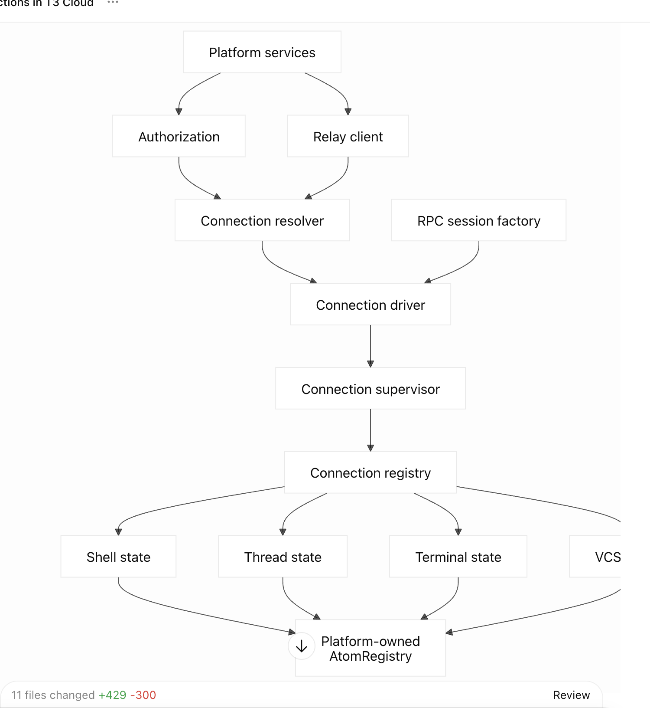

The current mistake is treating everything that depends on a connection as connection code. Dependency does not imply ownership. State, RPC transport, and authorization are separate concerns.

Proposed Structure

```
src/
  connection/
    model.ts
    errors.ts
    catalog.ts
    connectivity.ts
    wakeups.ts
    resolver.ts
    driver.ts
    supervisor.ts
    registry.ts
    onboarding.ts
    presentation.ts
    layer.ts
    index.ts

  authorization/
    remote.ts
    service.ts
    tokenStore.ts
    index.ts

  rpc/
    http.ts
    protocol.ts
    session.ts
    client.ts
    index.ts

  relay/
    managedRelay.ts
    managedRelayState.ts
    discovery.ts
    index.ts

  state/
    runtime.ts
    connections.ts
    entities.ts
    auth.ts
    cloud.ts
    shell.ts
    threads.ts
    terminal.ts
    vcs.ts
    filesystem.ts
    projects.ts
    review.ts
    server.ts
    sourceControl.ts
    orchestration.ts
    presentation.ts
    session.ts
    relayDiscovery.ts

  operations/
    projects.ts
    commands.ts

  platform/
    capabilities.ts
    persistence.ts
    source.ts
    storageDocument.ts
    index.ts

  environment/
    knownEnvironment.ts
    scoped.ts
    descriptor.ts
    endpoint.ts

  errors/
    errorTrace.ts
    transport.ts
```

Boundaries

connection/ owns only:

Desired versus actual connection state.
Retry scheduling and wake-up signals.
Connection target catalog.
Opening, supervising, and closing sessions.
Platform-independent connection presentation state.
It must not know about threads, shell snapshots, terminals, VCS, or React atoms.

rpc/ owns:

WebSocket protocol.
Session lifecycle.
Typed RPC execution and subscriptions.
Readiness and close signals consumed by the connection driver.
authorization/ turns credentials and target metadata into authorized connection parameters. It does not supervise connections.

relay/ owns the raw relay API, DPoP signer integration, and environment discovery. It does not own the connection state machine.

state/ owns shared application data:

Models, reducers, cache/retention behavior.
Effect services synchronizing RPC data into state.
Atom definitions and generic query/mutation/subscription bindings.
Simple RPC calls should use generic helpers from state/runtime.ts. We should not create a wrapper module for every RPC operation. operations/ is only for genuinely multi-step workflows.

Critical Change

The current registry must stop constructing an EnvironmentServices bundle containing shell, threads, commands, and RPC. That recreates the god-service problem indirectly.

Instead:



The registry exposes session availability and execution. Independent state modules consume it. Connection never imports state.

Current Mapping

connection/core/_ mostly becomes connection/_.
connection/transport/rpcSession.ts and remote/wsRpcProtocol.ts become rpc/_.
connection/transport/remoteAuthorization.ts becomes authorization/_.
Broker selection becomes connection/resolver.ts; bearer/DPoP implementation stays in authorization.
connection/services/threads.ts becomes state/threads.ts.
connection/services/authAccessSnapshot.ts becomes state/auth.ts.
connection/atoms/\* becomes domain files under state/.
Existing top-level shell, threads, terminal, and vcs state code merges into those state modules.
connection/services/runtime.ts should disappear rather than be relocated.
Public exports follow stable concerns such as `./connection`, `./rpc`,
`./authorization`, `./relay`, and individual `./state/threads` subpaths. There
is no root barrel, broad `./state` barrel, or public
application/core/services/transport implementation taxonomy.

I would make this as one structural cut with all callers migrated, without compatibility facades.
